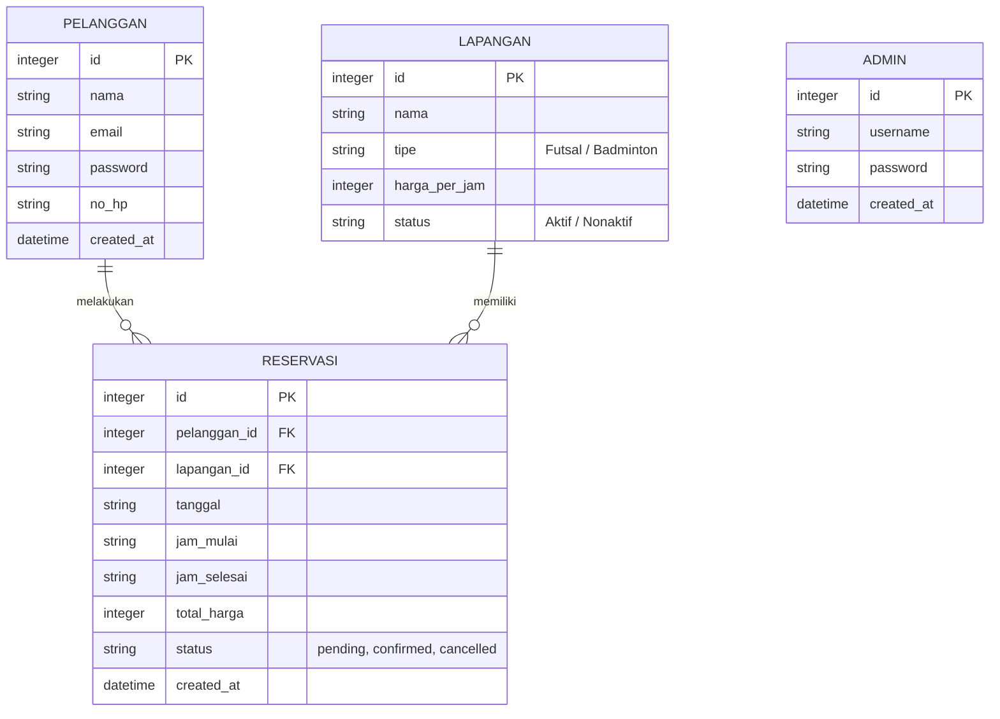

# ERD dan Skema Basis Data
**Proyek:** Sistem Reservasi Lapangan SM Sport Center
**Skema Sertifikasi BNSP:** Analis Program (SKM-2019-62010-002)

## 1. Entity Relationship Diagram (ERD)

Diagram di bawah ini menggambarkan struktur entitas dan relasi antar entitas pada sistem.



## 2. Penjelasan Entitas dan Relasi
- **PELANGGAN**: Menyimpan data pengguna publik yang mendaftar. (1 pelanggan dapat melakukan N reservasi).
- **LAPANGAN**: Menyimpan master data lapangan yang tersedia di SM Sport Center. (1 lapangan dapat memiliki N reservasi).
- **RESERVASI**: Tabel transaksional utama yang menyimpan jadwal *booking*. Memiliki dua relasi (Foreign Key) yaitu ke tabel PELANGGAN dan LAPANGAN.
- **ADMIN**: Tabel terpisah untuk menyimpan kredensial akses dashboard manajemen (tidak memiliki relasi langsung ke entitas lain secara sistem, namun admin mengelola semua entitas).

## 3. SQL Script (Schema & Seed Data)
Berikut adalah struktur *Data Definition Language* (DDL) SQLite yang digunakan.

```sql
-- Mengaktifkan dukungan Foreign Key
PRAGMA foreign_keys = ON;

-- 1. Tabel Pelanggan
CREATE TABLE IF NOT EXISTS pelanggan (
    id INTEGER PRIMARY KEY AUTOINCREMENT,
    nama TEXT NOT NULL,
    email TEXT UNIQUE NOT NULL,
    password TEXT NOT NULL,
    no_hp TEXT,
    created_at DATETIME DEFAULT CURRENT_TIMESTAMP
);

-- 2. Tabel Lapangan
CREATE TABLE IF NOT EXISTS lapangan (
    id INTEGER PRIMARY KEY AUTOINCREMENT,
    nama TEXT NOT NULL,
    tipe TEXT NOT NULL CHECK(tipe IN ('Futsal', 'Badminton')),
    harga_per_jam INTEGER NOT NULL,
    status TEXT DEFAULT 'Aktif' CHECK(status IN ('Aktif', 'Nonaktif'))
);

-- 3. Tabel Reservasi
CREATE TABLE IF NOT EXISTS reservasi (
    id INTEGER PRIMARY KEY AUTOINCREMENT,
    pelanggan_id INTEGER NOT NULL,
    lapangan_id INTEGER NOT NULL,
    tanggal TEXT NOT NULL,
    jam_mulai TEXT NOT NULL,
    jam_selesai TEXT NOT NULL,
    total_harga INTEGER NOT NULL,
    status TEXT DEFAULT 'pending' CHECK(status IN ('pending', 'confirmed', 'cancelled')),
    created_at DATETIME DEFAULT CURRENT_TIMESTAMP,
    FOREIGN KEY(pelanggan_id) REFERENCES pelanggan(id),
    FOREIGN KEY(lapangan_id) REFERENCES lapangan(id)
);

-- 4. Tabel Admin
CREATE TABLE IF NOT EXISTS admin (
    id INTEGER PRIMARY KEY AUTOINCREMENT,
    username TEXT UNIQUE NOT NULL,
    password TEXT NOT NULL,
    created_at DATETIME DEFAULT CURRENT_TIMESTAMP
);

-- Indexing untuk optimasi query
CREATE INDEX IF NOT EXISTS idx_reservasi_tanggal ON reservasi(lapangan_id, tanggal);
CREATE INDEX IF NOT EXISTS idx_reservasi_pelanggan ON reservasi(pelanggan_id);
```

### 3.1 Penjelasan Constraint dan Indeks
- `CHECK`: Digunakan untuk memastikan integritas data *enum* seperti tipe lapangan dan status reservasi, menghindari masuknya string yang tidak diizinkan.
- `FOREIGN KEY`: Memastikan konsistensi data reservasi, tidak ada reservasi yang merujuk ke ID pelanggan atau lapangan yang tidak ada.
- `UNIQUE`: Pada email dan username untuk menghindari duplikasi pendaftaran.
- `INDEX idx_reservasi_tanggal`: Sangat penting untuk mempercepat proses pencarian ketersediaan jadwal dan fungsi `cekBentrok`.

### 3.2 Seed Data Script (Initial Data)
```sql
-- Seed Admin (Password di-hash dengan bcrypt: admin123)
INSERT OR IGNORE INTO admin (username, password) VALUES 
('admin', '$2a$10$xyz...'); 

-- Seed Data Lapangan
INSERT OR IGNORE INTO lapangan (nama, tipe, harga_per_jam) VALUES
('Futsal A', 'Futsal', 150000),
('Futsal B', 'Futsal', 150000),
('Badminton 1', 'Badminton', 80000),
('Badminton 2', 'Badminton', 80000),
('Badminton 3', 'Badminton', 80000);
```
