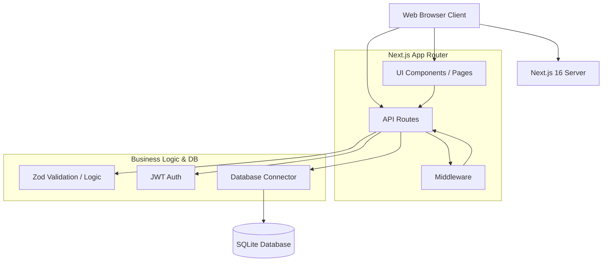

# Dokumentasi Kode Program
**Proyek:** Sistem Reservasi Lapangan SM Sport Center
**Skema Sertifikasi BNSP:** Analis Program (SKM-2019-62010-002)

## 1. Arsitektur Sistem



## 2. Struktur Direktori

Sistem menggunakan standar **App Router** dari Next.js.
```text
sm-sport-reservasi/
├── app/
│   ├── admin/          # (Pages) Area Admin (Dashboard, Lapangan, dll)
│   ├── api/            # (Routes) API Endpoints
│   ├── reservasi/      # (Pages) Area Pelanggan
│   ├── login/          # (Pages) Login pelanggan
│   ├── register/       # (Pages) Registrasi pelanggan
│   ├── jadwal/         # (Pages) Cek ketersediaan publik
│   ├── layout.tsx      # Root Layout
│   └── page.tsx        # Landing Page
├── db/
│   └── schema.sql      # Struktur basis data
├── docs/               # Dokumentasi BNSP
├── lib/
│   ├── auth.ts         # Modul autentikasi (JWT)
│   ├── db.ts           # Konektor SQLite
│   └── validasi.ts     # Zod schema & business logic
└── middleware.ts       # Route protection middleware
```

## 3. Penjelasan Modul Inti

### A. `lib/db.ts`
Bertugas menginisiasi koneksi ke SQLite via `better-sqlite3`.
- Mengaktifkan `PRAGMA foreign_keys = ON` untuk konsistensi relasi.
- Mengaktifkan `PRAGMA journal_mode = WAL` untuk optimasi proses baca/tulis secara konkuren (mencegah *database locked*).

### B. `lib/auth.ts`
Menangani pembuatan dan verifikasi JSON Web Token (JWT) menggunakan *library* `jose`.
- `signToken()`: Membuat token dari *payload*.
- `verifyToken()`: Memvalidasi token.
- Fungsi *helper* mengatur *cookies* (HttpOnly, Secure) agar aman dari serangan XSS.

### C. `lib/validasi.ts`
Menjadi pusat *Business Logic* dan validasi struktur data menggunakan `zod`.
- **Zod Schemas**: Memastikan tipe data dari inputan klien (*request body*) sesuai yang diharapkan sebelum masuk ke basis data (mencegah SQL Injection dan Error).
- `cekBentrok()`: Fungsi pengecekan ketersediaan jadwal, menghitung irisan waktu (*overlap*) antara jadwal baru dengan jadwal yang ada di basis data.
- `hitungDurasiJam()`: Kalkulator selisih jam.
- `buatReservasi()`: Memanfaatkan *Database Transaction* `db.transaction()` agar jika insert gagal, proses bisa di-*rollback*.

### D. `middleware.ts`
Bertindak sebagai "penjaga pintu" (Proxy/Interceptor) di sisi server.
- Melakukan pencegatan permintaan masuk ke *route* `/admin/*` dan `/reservasi/*`.
- Membaca *cookies* JWT, memverifikasi menggunakan fungsi dari `auth.ts`, dan memblokir akses (Response 401/403 atau Redirect ke login) jika token tidak valid/kadaluarsa atau hak akses salah (Admin vs Pelanggan).

## 4. Daftar API Endpoints
Terdapat 11 rute API berarsitektur REST-ful:

| Method | Path | Kebutuhan Auth | Deskripsi |
|--------|------|----------------|-----------|
| POST | `/api/auth/register` | Tidak | Mendaftarkan pengguna baru |
| POST | `/api/auth/login` | Tidak | Membuat sesi login (pelanggan) |
| POST | `/api/admin/login` | Tidak | Membuat sesi login (admin) |
| POST | `/api/auth/logout` | Memiliki Sesi | Menghapus token (Logout) |
| GET | `/api/lapangan` | Tidak | Mengambil daftar lapangan aktif |
| POST/PUT/DEL | `/api/lapangan[/:id]`| Admin | Manipulasi data lapangan |
| GET | `/api/lapangan/:id/jadwal`| Tidak | Melihat slot yang sudah ter-booking |
| GET/POST | `/api/reservasi` | Pelanggan/Admin| Lihat daftar / Buat reservasi baru |
| GET/PUT | `/api/reservasi/:id` | Pelanggan/Admin| Lihat detail / Update status reservasi |
| GET | `/api/pelanggan` | Admin | Lihat seluruh data pelanggan |
| GET | `/api/laporan` | Admin | Data ringkasan pendapatan & Export CSV |

## 5. Design Pattern & Dependency
- **Pattern**: *Controller-Service-Repository* (Disederhanakan). *API route* (Controller) memanggil *logic* dari `lib/validasi.ts` (Service) yang mengakses basis data melalui `lib/db.ts` (Repository).
- **Core Dependencies**: `next` (Framework), `react`, `better-sqlite3` (Database), `jose` (Autentikasi), `zod` (Validasi Input), `tailwindcss` (Styling).
