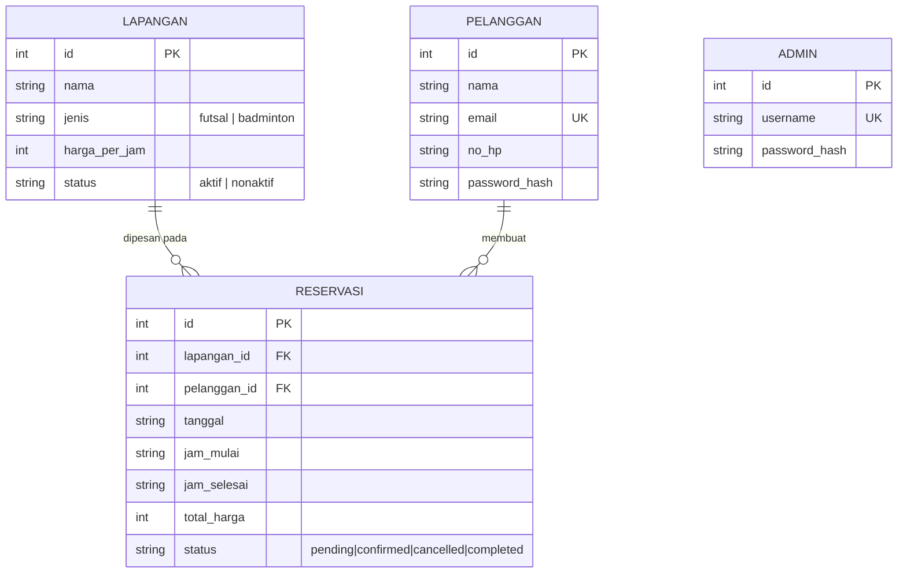

# PRD — Sistem Reservasi Lapangan SM Sport Center

**Untuk:** Bukti Uji Kompetensi BNSP — Skema Okupasi **Analis Program** (SKM-2019-62010-002)
**Stack:** Next.js 14 (App Router) + TypeScript + SQLite (`better-sqlite3`) + Tailwind CSS
**Mode:** Full lokal/offline — tidak butuh internet buat demo, cukup jalan di laptop
**Dibuat untuk:** vibe coding (paste PRD ini ke Claude Code / AI coding assistant, generate section per section)

---

## 0. Cara Pakai Dokumen Ini

Kerjain per **Kelompok Pekerjaan** (bagian 8), urutannya udah didesain biar nyambung satu sama lain. Tiap section teknis (schema, business logic, API, halaman) udah dalam bentuk siap-tempel ke AI coding assistant. Prioritas ditandai:

- **P0** = wajib ada, ini yang dinilai asesor langsung (nempel ke unit kompetensi)
- **P1** = penting buat lengkapin cerita skenario (laporan, dashboard)
- **P2** = nice-to-have, kerjain kalau waktu masih sisa

---

## 1. Ringkasan Proyek

SM Sport Center punya 2 lapangan futsal + 3 lapangan badminton. Reservasi saat ini manual (telepon/WA) sehingga sering *double booking*, salah catat transaksi, susah bikin laporan, dan pelanggan gak tau lapangan mana yang kosong.

**Tujuan sistem:** web app yang dipakai **pelanggan** (booking mandiri, lihat jadwal kosong) dan **admin** (kelola lapangan, kelola reservasi, lihat laporan) — dengan validasi anti-bentrok jadwal sebagai fitur inti.

## 2. Aktor

| Aktor | Deskripsi | Akses |
|---|---|---|
| **Pelanggan** | Customer yang booking lapangan | Register/login, lihat jadwal, buat/lihat/batalin reservasi sendiri |
| **Admin** | Pengelola SM Sport Center | Login terpisah, CRUD lapangan, kelola semua reservasi, lihat data pelanggan, lihat laporan |

## 3. Functional Requirements

| # | Requirement | Prioritas | Unit Kompetensi Terkait |
|---|---|---|---|
| FR1 | Pelanggan bisa registrasi & login (email + password) | P0 | Akses Basis Data |
| FR2 | Admin login terpisah (username + password, akun sudah di-seed) | P0 | Akses Basis Data |
| FR3 | Lihat daftar lapangan + status ketersediaan per tanggal (grid jam) | P0 | Algoritma Pemrograman |
| FR4 | Pelanggan buat reservasi baru (pilih lapangan, tanggal, jam mulai-selesai) | P0 | SQL, Akses Basis Data |
| FR5 | Sistem **menolak** reservasi yang bentrok jadwal dengan reservasi lain di lapangan & tanggal yang sama | **P0 (inti)** | Algoritma, Debugging |
| FR6 | Sistem hitung otomatis `total_harga` dari durasi × harga/jam lapangan | P0 | Algoritma Pemrograman |
| FR7 | Pelanggan lihat & cari riwayat reservasi sendiri | P0 | SQL |
| FR8 | Pelanggan batalin reservasi (status → `cancelled`) | P1 | Akses Basis Data |
| FR9 | Admin CRUD lapangan (tambah/edit/nonaktifkan) | P0 | SQL, Akses Basis Data |
| FR10 | Admin lihat/cari/filter semua reservasi, ubah status (confirm/cancel) | P0 | SQL |
| FR11 | Admin lihat/cari data pelanggan | P1 | SQL |
| FR12 | Admin lihat laporan penggunaan lapangan (filter tanggal, total pemakaian, revenue) | P1 | SQL, Analisis |
| FR13 | Export laporan ke CSV | P2 | - |

## 4. Non-Functional Requirements

| Aspek | Requirement |
|---|---|
| **Keamanan** | Password di-hash pakai `bcryptjs`. Semua query SQL pakai *parameterized statement* (gak ada string concat langsung — ini sekalian jadi bukti "Menggunakan SQL" yang aman). Session pakai JWT di *httpOnly cookie*. Route `/admin/*` dan `/reservasi/*` diproteksi middleware. |
| **Performa** | Query cek-bentrok < 100ms meski data setahun (butuh index). Halaman utama load < 2 detik lokal. |
| **Konsistensi Data** | Insert reservasi dibungkus **transaction** (cek-bentrok + insert harus atomik) — ini yang mencegah race condition penyebab bug "reservasi tetap tersimpan meski bentrok". |
| **Maintainability** | Tiap fungsi utama dikasih komentar/JSDoc singkat (jadi bahan Dokumen Kode Program). |
| **Portability** | Semua lokal: SQLite file based, gak ada dependency cloud. Tinggal `npm install` + `npm run db:init` di laptop manapun. |
| **Auditability** | Semua tabel transaksional punya `created_at`/`updated_at`. |

## 5. Asumsi Bisnis (Silakan Disesuaikan)

- Jam operasional: **08:00–23:00**
- Harga: Futsal **Rp150.000/jam**, Badminton **Rp80.000/jam**
- Pembatalan: boleh selama status masih `pending`/`confirmed` dan belum lewat jam mulai
- Slot booking bebas (bukan slot tetap per jam), minimal durasi 1 jam

## 6. Ringkasan Analisis Skalabilitas (bahan Dokumen Analisis Skalabilitas — deliverable terpisah)

Estimasi kasar buat isi dokumen skalabilitas kalian:

- 5 lapangan × 15 jam operasional = maksimum teoritis ±50 slot 1-jam/hari
- Asumsi utilisasi realistis 50–60% → **±25–30 reservasi/hari**
- Proyeksi setahun: **±9.000–11.000 baris** di tabel `reservasi`; 5 tahun ±50.000 baris — volume ini kecil, SQLite jelas cukup

**Potensi bottleneck yang bisa diidentifikasi (dan jadi rekomendasi perbaikan):**
1. Query cek-bentrok full-scan tanpa index → melambat seiring data bertambah → **rekomendasi: index `(lapangan_id, tanggal)`** (sudah termasuk di schema bagian 9)
2. SQLite single-writer (satu file, satu penulis di satu waktu) → cukup untuk skala 1 cabang, tapi jadi bottleneck kalau bisnis ekspansi multi-cabang dengan trafik tinggi → **rekomendasi: migrasi ke PostgreSQL/MySQL kalau scale-up**
3. Query laporan (`GROUP BY` + `SUM` lintas tanggal) makin berat tanpa index tanggal → **rekomendasi: index tambahan di kolom `tanggal`**
4. Tanpa pagination, daftar reservasi admin bisa berat kalau data ribuan baris → **rekomendasi: pagination `LIMIT`/`OFFSET`**

Ini bisa langsung jadi isi bagian "identifikasi bottleneck + rekomendasi" di Dokumen Analisis Skalabilitas kalian.

## 7. Tech Stack

| Layer | Pilihan | Alasan |
|---|---|---|
| Framework | **Next.js 14 (App Router) + TypeScript** | Full-stack satu project (UI + API routes), gampang di-vibe-code |
| Database | **SQLite via `better-sqlite3`** | File-based, zero-config, jalan offline, API-nya **synchronous** → transaction gampang dibikin atomik (kunci buat fix bug bentrok) |
| Styling | **Tailwind CSS** | Cepat buat UI rapi tanpa nulis CSS manual |
| Auth | JWT (`jose`) di httpOnly cookie + `bcryptjs` | Simpel, gak butuh service eksternal, gampang dijelasin ke asesor |
| Validasi input | `zod` | Skema validasi jelas & reusable |
| Testing | `vitest` | Ringan, cepat setup di project TS |

## 8. Struktur Folder Proyek

```
sm-sport-reservasi/
├── app/
│   ├── page.tsx                    # Landing: pilih lapangan + jadwal
│   ├── login/page.tsx
│   ├── register/page.tsx
│   ├── reservasi/
│   │   ├── page.tsx                 # Riwayat reservasi saya
│   │   ├── baru/page.tsx            # Form booking
│   │   └── [id]/page.tsx
│   ├── admin/
│   │   ├── login/page.tsx
│   │   ├── page.tsx                 # Dashboard
│   │   ├── lapangan/page.tsx
│   │   ├── reservasi/page.tsx
│   │   ├── pelanggan/page.tsx
│   │   └── laporan/page.tsx
│   ├── api/
│   │   ├── auth/register/route.ts
│   │   ├── auth/login/route.ts
│   │   ├── auth/logout/route.ts
│   │   ├── admin/login/route.ts
│   │   ├── lapangan/route.ts
│   │   ├── lapangan/[id]/route.ts
│   │   ├── lapangan/[id]/jadwal/route.ts
│   │   ├── reservasi/route.ts
│   │   ├── reservasi/[id]/route.ts
│   │   ├── pelanggan/route.ts
│   │   └── laporan/route.ts
│   └── layout.tsx
├── lib/
│   ├── db.ts                # init better-sqlite3 + PRAGMA
│   ├── auth.ts               # sign/verify JWT, cookie helper
│   └── validasi.ts           # cekBentrok(), hitungDurasiJam(), zod schema
├── db/
│   ├── schema.sql
│   └── seed.ts
├── tests/
│   ├── unit/validasi.test.ts
│   └── integration/alur-reservasi.test.ts
├── middleware.ts
├── data/sm-sport.db          # (gitignore)
├── .env.local
└── package.json
```

## 9. Desain Basis Data

### 9.1 ERD



> Tip: paste kode mermaid di atas ke draw.io / mermaid.live buat dapet gambar ERD yang rapi buat deliverable "ERD dan SQL Script".

### 9.2 SQL Script — `db/schema.sql`

```sql
PRAGMA foreign_keys = ON;
PRAGMA journal_mode = WAL;

CREATE TABLE lapangan (
  id INTEGER PRIMARY KEY AUTOINCREMENT,
  nama TEXT NOT NULL,
  jenis TEXT NOT NULL CHECK (jenis IN ('futsal','badminton')),
  harga_per_jam INTEGER NOT NULL,
  status TEXT NOT NULL DEFAULT 'aktif' CHECK (status IN ('aktif','nonaktif')),
  created_at TEXT NOT NULL DEFAULT (datetime('now'))
);

CREATE TABLE pelanggan (
  id INTEGER PRIMARY KEY AUTOINCREMENT,
  nama TEXT NOT NULL,
  email TEXT NOT NULL UNIQUE,
  no_hp TEXT NOT NULL,
  password_hash TEXT NOT NULL,
  created_at TEXT NOT NULL DEFAULT (datetime('now'))
);

CREATE TABLE admin (
  id INTEGER PRIMARY KEY AUTOINCREMENT,
  username TEXT NOT NULL UNIQUE,
  password_hash TEXT NOT NULL
);

CREATE TABLE reservasi (
  id INTEGER PRIMARY KEY AUTOINCREMENT,
  lapangan_id INTEGER NOT NULL REFERENCES lapangan(id),
  pelanggan_id INTEGER NOT NULL REFERENCES pelanggan(id),
  tanggal TEXT NOT NULL,           -- 'YYYY-MM-DD'
  jam_mulai TEXT NOT NULL,         -- 'HH:MM'
  jam_selesai TEXT NOT NULL,       -- 'HH:MM'
  total_harga INTEGER NOT NULL,
  status TEXT NOT NULL DEFAULT 'confirmed'
    CHECK (status IN ('pending','confirmed','cancelled','completed')),
  catatan TEXT,
  created_at TEXT NOT NULL DEFAULT (datetime('now')),
  updated_at TEXT NOT NULL DEFAULT (datetime('now'))
);

-- index ini yang mencegah query cek-bentrok jadi lambat pas data udah banyak
CREATE INDEX idx_reservasi_lapangan_tanggal ON reservasi (lapangan_id, tanggal);
CREATE INDEX idx_reservasi_pelanggan ON reservasi (pelanggan_id);
```

### 9.3 Seed Data — `db/seed.ts` (garis besar)

```ts
import bcrypt from 'bcryptjs';
import { db } from '../lib/db';

// 1. jalankan schema.sql
// 2. seed lapangan
db.prepare(`INSERT INTO lapangan (nama, jenis, harga_per_jam) VALUES (?,?,?)`).run('Futsal A', 'futsal', 150000);
db.prepare(`INSERT INTO lapangan (nama, jenis, harga_per_jam) VALUES (?,?,?)`).run('Futsal B', 'futsal', 150000);
db.prepare(`INSERT INTO lapangan (nama, jenis, harga_per_jam) VALUES (?,?,?)`).run('Badminton 1', 'badminton', 80000);
db.prepare(`INSERT INTO lapangan (nama, jenis, harga_per_jam) VALUES (?,?,?)`).run('Badminton 2', 'badminton', 80000);
db.prepare(`INSERT INTO lapangan (nama, jenis, harga_per_jam) VALUES (?,?,?)`).run('Badminton 3', 'badminton', 80000);

// 3. seed admin (password di-hash, JANGAN plaintext)
const adminHash = bcrypt.hashSync('admin123', 10);
db.prepare(`INSERT INTO admin (username, password_hash) VALUES (?,?)`).run('admin', adminHash);

// 4. seed beberapa pelanggan contoh
const plgHash = bcrypt.hashSync('pelanggan123', 10);
db.prepare(`INSERT INTO pelanggan (nama, email, no_hp, password_hash) VALUES (?,?,?,?)`)
  .run('Budi Santoso', 'budi@mail.com', '081234567890', plgHash);
db.prepare(`INSERT INTO pelanggan (nama, email, no_hp, password_hash) VALUES (?,?,?,?)`)
  .run('Siti Aminah', 'siti@mail.com', '081298765432', plgHash);
```

## 10. Business Logic Inti — Validasi Bentrok Jadwal

Ini bagian **paling penting** di seluruh sistem — langsung nyambung ke FR5 dan ke deliverable "Laporan Debugging" (bagian 12).

### 10.1 Formula overlap yang BENAR

Dua rentang waktu bentrok kalau: `mulai_baru < selesai_lama` **DAN** `selesai_baru > mulai_lama`.

```ts
// lib/validasi.ts
import { db } from './db';

interface CekBentrokParams {
  lapangan_id: number;
  tanggal: string;
  jam_mulai: string;
  jam_selesai: string;
  reservasi_id_exclude?: number; // dipakai saat update biar gak bentrok sama diri sendiri
}

export function cekBentrok(p: CekBentrokParams): boolean {
  const query = `
    SELECT COUNT(*) as jumlah
    FROM reservasi
    WHERE lapangan_id = ?
      AND tanggal = ?
      AND status IN ('pending','confirmed')
      AND jam_mulai < ?
      AND jam_selesai > ?
      ${p.reservasi_id_exclude ? 'AND id != ?' : ''}
  `;
  const params = [p.lapangan_id, p.tanggal, p.jam_selesai, p.jam_mulai];
  if (p.reservasi_id_exclude) params.push(p.reservasi_id_exclude);

  const row = db.prepare(query).get(...params) as { jumlah: number };
  return row.jumlah > 0;
}

export function hitungDurasiJam(jamMulai: string, jamSelesai: string): number {
  const [h1, m1] = jamMulai.split(':').map(Number);
  const [h2, m2] = jamSelesai.split(':').map(Number);
  return ((h2 * 60 + m2) - (h1 * 60 + m1)) / 60;
}
```

### 10.2 Insert yang atomik (cek + simpan dalam satu transaction)

Ini kuncinya biar gak ada race condition — `better-sqlite3` sifatnya **synchronous**, jadi `db.transaction()` di bawah ini beneran atomik, gak ada request lain yang bisa nyelip di antara cek dan insert.

```ts
export const buatReservasi = db.transaction((data: {
  lapangan_id: number; pelanggan_id: number; tanggal: string;
  jam_mulai: string; jam_selesai: string;
}) => {
  if (cekBentrok(data)) {
    throw new Error('BENTROK_JADWAL');
  }
  const lapangan = db.prepare('SELECT harga_per_jam FROM lapangan WHERE id = ?')
    .get(data.lapangan_id) as { harga_per_jam: number };
  const total_harga = lapangan.harga_per_jam * hitungDurasiJam(data.jam_mulai, data.jam_selesai);

  const info = db.prepare(`
    INSERT INTO reservasi (lapangan_id, pelanggan_id, tanggal, jam_mulai, jam_selesai, total_harga, status)
    VALUES (?, ?, ?, ?, ?, ?, 'confirmed')
  `).run(data.lapangan_id, data.pelanggan_id, data.tanggal, data.jam_mulai, data.jam_selesai, total_harga);

  return info.lastInsertRowid;
});
```

## 11. Halaman & API

### 11.1 Halaman

| Path | Aktor | Isi |
|---|---|---|
| `/` | Publik | Pilih lapangan + tanggal → grid ketersediaan jam |
| `/register`, `/login` | Pelanggan | Form auth |
| `/reservasi/baru` | Pelanggan | Form booking, live-check bentrok sebelum submit |
| `/reservasi` | Pelanggan | Riwayat booking sendiri + tombol batal |
| `/admin/login` | Admin | Login terpisah |
| `/admin` | Admin | Dashboard ringkas (reservasi hari ini, revenue) |
| `/admin/lapangan` | Admin | CRUD lapangan |
| `/admin/reservasi` | Admin | Semua reservasi, filter tanggal/status/lapangan |
| `/admin/pelanggan` | Admin | List + cari pelanggan |
| `/admin/laporan` | Admin | Laporan penggunaan & revenue per rentang tanggal |

### 11.2 API Endpoints

| Method | Path | Auth | Deskripsi |
|---|---|---|---|
| POST | `/api/auth/register` | - | Registrasi pelanggan |
| POST | `/api/auth/login` | - | Login pelanggan |
| POST | `/api/admin/login` | - | Login admin |
| POST | `/api/auth/logout` | Cookie | Hapus session |
| GET | `/api/lapangan` | - | Daftar lapangan |
| POST/PUT/DELETE | `/api/lapangan[/:id]` | Admin | CRUD lapangan |
| GET | `/api/lapangan/:id/jadwal?tanggal=` | - | Jadwal terisi utk 1 lapangan/tanggal |
| GET | `/api/reservasi` | Pelanggan/Admin | List (milik sendiri / semua kalau admin) |
| POST | `/api/reservasi` | Pelanggan | Buat reservasi (pakai `buatReservasi()`) |
| PUT | `/api/reservasi/:id` | Pemilik/Admin | Ubah status (cancel/confirm) |
| GET | `/api/pelanggan` | Admin | Cari pelanggan |
| GET | `/api/laporan?dari=&sampai=&lapangan_id=` | Admin | Rekap penggunaan + revenue |

## 12. Skenario Debugging (bahan Laporan Debugging)

Doc DIT eksplisit minta kasus: *"reservasi tetap tersimpan meskipun jadwal sudah terisi"*. Ini pola bug klasik overlap-check yang salah logika. Supaya kalian punya bukti debugging yang otentik, sengaja tulis versi **salah** dulu, reproduksi bug-nya, baru fix — commit terpisah di git biar ada histori before/after.

**Versi bug (jangan dipakai di final):**
```ts
function cekBentrokSALAH(lapangan_id: number, tanggal: string, jam_mulai: string): boolean {
  // BUG: cuma cek jam_mulai yang PERSIS SAMA, gak cek overlap range
  const row = db.prepare(`
    SELECT COUNT(*) as jumlah FROM reservasi
    WHERE lapangan_id = ? AND tanggal = ? AND jam_mulai = ?
  `).get(lapangan_id, tanggal, jam_mulai) as { jumlah: number };
  return row.jumlah > 0;
}
```

**Cara reproduksi:**
1. Buat reservasi Lapangan Futsal A, 09:00–10:00
2. Coba buat reservasi kedua di lapangan & tanggal sama, jam 09:30–10:30
3. **Hasil bug:** tersimpan (padahal jelas overlap 09:30–10:00), karena `jam_mulai` (09:00 vs 09:30) beda jadi dianggap gak bentrok

**Root cause:** logic cuma exact-match `jam_mulai`, bukan overlap-range check.

**Fix:** ganti ke formula overlap di bagian 10.1 (`jam_mulai < selesai_baru AND jam_selesai > mulai_baru`).

**Verifikasi:** ulangi langkah reproduksi → sekarang ditolak dengan pesan "Jadwal bentrok".

**Isi Laporan Debugging kalian nanti:** deskripsi bug → langkah reproduksi → root cause analysis → kode sebelum/sesudah (screenshot diff git) → hasil verifikasi setelah fix.

## 13. Rencana Testing

### 13.1 Unit Test (`tests/unit/validasi.test.ts`)

| No | Skenario | Hasil Diharapkan |
|---|---|---|
| 1 | Login benar | Berhasil masuk |
| 2 | Login salah | Pesan error |
| 3 | Reservasi valid (jam kosong) | Data tersimpan |
| 4 | Reservasi bentrok penuh (jam sama persis) | Ditolak |
| 5 | Reservasi bentrok sebagian (overlap 09:30-10:30 vs 09:00-10:00) | Ditolak — kasus tepat dari bug bagian 12 |
| 6 | `jam_mulai` > `jam_selesai` | Ditolak validasi input |
| 7 | Registrasi email yang sudah dipakai | Ditolak (unique constraint) |
| 8 | Admin tambah lapangan baru | Data tersimpan |

### 13.2 Integration Test (`tests/integration/alur-reservasi.test.ts`)

Alur: **Login → Reservasi → Simpan → Laporan**

1. Login pelanggan → dapat session
2. Submit form reservasi valid → status 201, `total_harga` sesuai perhitungan
3. Cek data tersimpan di tabel `reservasi`
4. Login admin → buka `/admin/laporan` → reservasi tadi muncul di rekap

Dokumentasikan tiap langkah dengan screenshot (jadi Dokumen Testing + Laporan Integrasi Testing).

## 14. Rencana Profiling (Kelompok Pekerjaan 3)

1. Build production dulu (mode `dev` lebih lambat & gak representatif): `npm run build && npm start`
2. Buka Chrome DevTools → tab **Lighthouse** → jalankan audit Performance di halaman `/` dan `/admin/laporan`
3. Cek tab **Network** buat lihat endpoint mana yang lambat
4. Saran skenario before/after yang natural: jalankan `/api/laporan` **sebelum** index `tanggal` ditambah (data dummy banyak) → catat waktu response → tambah index → ukur lagi → **hasil dan perbandingannya ini yang jadi bukti "Hasil Profiling"**
5. Susun temuan: fungsi/endpoint mana yang lambat + rekomendasi (index, pagination, dsb — lihat bagian 6)

## 15. Setup & Tools yang Harus Disiapin

**Wajib install:**

| Tool | Fungsi | Link |
|---|---|---|
| Node.js LTS 20.x+ | Runtime buat Next.js | nodejs.org (atau `nvm install 20`) |
| Git | Version control + histori commit = bukti tambahan debugging | git-scm.com |
| VS Code | Editor | code.visualstudio.com |
| DB Browser for SQLite | GUI liat isi database pas demo ke asesor | sqlitebrowser.org |
| draw.io / diagrams.net | Gambar ERD visual (lu udah biasa pake ini) | draw.io |
| Chrome/Edge | DevTools buat profiling (wajib, bagian 14) | - |

**Extension VS Code yang ngebantu:**
- ESLint
- Tailwind CSS IntelliSense
- SQLite Viewer (qwtel) — liat isi `.db` langsung di editor
- Thunder Client — test API endpoint tanpa keluar VS Code

**Opsional:**
- Claude Code (VS Code extension / desktop app) — biar PRD ini bisa langsung dieksekusi jadi kode section-per-section di dalam editor

**Instalasi awal:**

```bash
mkdir sm-sport-reservasi && cd sm-sport-reservasi
npx create-next-app@latest . --typescript --tailwind --app --no-src-dir --import-alias "@/*"

npm install better-sqlite3 bcryptjs jose zod date-fns
npm install -D @types/better-sqlite3 @types/bcryptjs vitest tsx
```

**`.env.local`:**
```
JWT_SECRET=ganti-dengan-string-random-panjang
DATABASE_PATH=./data/sm-sport.db
```

**`package.json` scripts:**
```json
{
  "scripts": {
    "dev": "next dev",
    "build": "next build",
    "start": "next start",
    "db:init": "tsx db/seed.ts",
    "test": "vitest run"
  }
}
```

**Cara jalanin:**
```bash
npm install
npm run db:init      # bikin schema + seed data
npm run dev           # development, buka http://localhost:3000
# pas mau profiling/demo final:
npm run build && npm start
```

## 16. Checklist Bukti (8 Deliverable Wajib)

| # | Bukti | Sumber di Project Ini |
|---|---|---|
| 1 | Dokumen Analisis Skalabilitas | Tulis berdasarkan bagian 6 (estimasi + bottleneck) |
| 2 | ERD dan SQL Script | Bagian 9.1 (export draw.io) + `db/schema.sql` |
| 3 | User Interface dan Source Code | Screenshot tiap halaman bagian 11.1 + repo GitHub |
| 4 | Dokumentasi Kode Program | Komentar/JSDoc di kode + README ringkas struktur & modul |
| 5 | Laporan Debugging | Bagian 12, lengkap dengan commit before/after |
| 6 | Hasil Profiling | Bagian 14, screenshot Lighthouse + tabel before/after |
| 7 | Hasil Unit & Integration Testing | Bagian 13, output `npm run test` + screenshot alur |
| 8 | Hasil Perancangan & Demonstrasi Sistem | Rekaman/screenshot alur end-to-end lengkap |

## 17. Timeline Pengerjaan (Saran)

| Hari | Fokus |
|---|---|
| 1 | Setup project, schema.sql, seed, gambar ERD → cicil bukti #1 & #2 |
| 2–3 | Auth (login/register pelanggan+admin), CRUD lapangan, form reservasi + validasi bentrok |
| 4 | Admin panel: kelola reservasi, pelanggan, laporan |
| 5 | Dokumentasi kode (README + komentar), unit & integration test |
| 6 | Skenario debugging (bagian 12) + profiling (bagian 14) |
| 7 | Susun slide presentasi (15 menit) + compile 8 bukti + latihan tanya-jawab |

## 18. Tips Presentasi (15 menit presentasi + 15 menit tanya jawab)

Asesor bakal nilai: ketepatan jawaban, penguasaan materi/studi kasus, rasionalitas penyelesaian. Siapin narasi singkat tiap bagian: **masalah bisnis → solusi teknis → bukti kerja**. Yang paling sering ditanya biasanya justru bagian 10 (kenapa pakai transaction, kenapa formula overlap-nya begitu) dan bagian 12 (proses debugging) — kuasai dua ini paling detail karena itu inti kompetensi "Analis Program".
